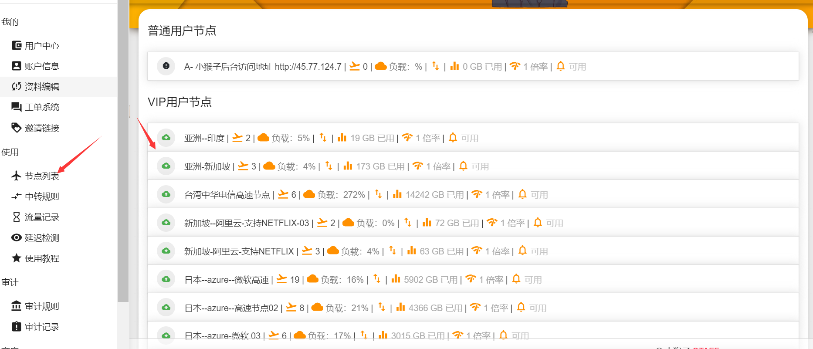

# 小猴子科学上网

##                              **小猴子后台主页地址**

\*\*\*\*


**www.menmanyu.com 已经DNS污染 无法使用 （放弃）**



   **www.menmanyu.club   被墙 大陆地区DNS污染，开代理可以打开**



**www.menmanyu.site 被墙  大陆地区DNS污染，开代理可以打开**



[www.xiaohouzilala.xyz](www.xiaohouzipapa.tech) 最新 大陆地区可以访问


**最新登陆面板地址**:


如果您忘记小猴子网站 请记住小猴子永远可以打开的后台链接

[github.com/xiaohouzivpn/xiaohouzi](https://github.com/xiaohouzivpn/xiaohouzi)


请大家使用小猴子最新的防封客户端：这里有WINDOWS 版本和 安卓版本





### 如果阁下有任何问题可以联系小猴子，小猴子的邮箱 ppssqqq@gmail.com

**面板基本使用教程：**

**查看您的订阅节点 ，vip到期时间，账户余额，以及在线设备数?**

请您在 我的-&gt;用户中心里面查看

| 账号等级ｖｉｐ３ | 有权权限查看所有小猴子节点 |
| :--- | :--- |
| 等级过期时间 | ｖｉｐ大概是那个时候需要重新购买套餐才能使用 |
| 等级有效期 | 显示ｖｉｐ套餐时间（重要：记得块没的时候续费充值并购买套餐） |
| 账号有效期 | 这个是自动释放账号，一般是１０年后才会释放 |
| 在线设备数 | 小猴子限制最多同时３台设备科学上网 |

**修改您自己的账号密码以或者密码自己的节点密码？**

在面板—&gt;我的—&gt;资料编辑 —–在这里可以修改您的账号密码以及节点连接密码

**查询您自己的服务器节点信息**

面板—&gt;使用—&gt;节点列表 点击您需要采集的服务器信息，这里会显示出来SSR 文字配置信息 ，SS或者SSR 二维码配置图片（方便您收录到自己的客户端）

**为您自己的账号充值并购买套餐时间**

面板余额充值 ： 面板–&gt;商店–&gt;充值 （请使用支付宝）

购买套餐: 面板—&gt;商店—&gt;套餐购买

PS ：请您充值余额后务必购买套餐，（这样节点才能显示并使用）



