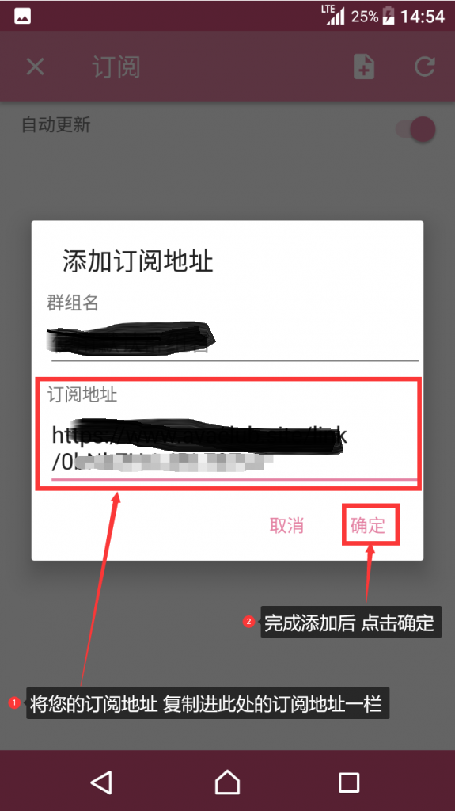
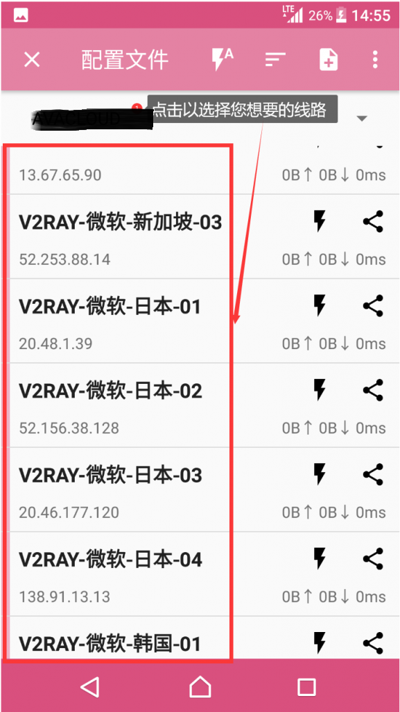

# android-ssr&v2ray原版

**部分安卓机型，使用过程中断网，以华为手机为例，设置-&gt;应用-&gt;应用启动管理-加速器客户端-&gt;手动管理（允许自启动，允许关联启动，允许后台活动全部打开。）部分机型需开启“请忽略电池优化”等相关功能。**

安卓原版SSR V2RAY版本特点 同时支持SSR V2RAY 节点[安卓SSR V2RAY 原版下载](https://www.shenlejiang.xyz/upload/androidxiaohouziorgin.apk)

—-&gt;&gt;&gt;&gt;加速下载链接地址—chrome谷歌浏览器请手动复制一下链接到新页面下载



**下方是本软件的图文教程**（使用订阅地址进行订阅线路）

第一步：点击shadowsocks R

第二步：点击右下角＋号

第三步：点击 管理SSR/V2订阅

第四步：点击打开自动更新的按钮 然后点击＋号添加订阅

提示：您的订阅地址在网站面板的首页—-个人中心里面 点击复制即可

第五步：将您的订阅地址复制进订阅地址一栏 然后点击确定

第六步：点击X号 返回线路列表

第七步：选择一个您想要的线路

第八步：点击按钮 启动即可

