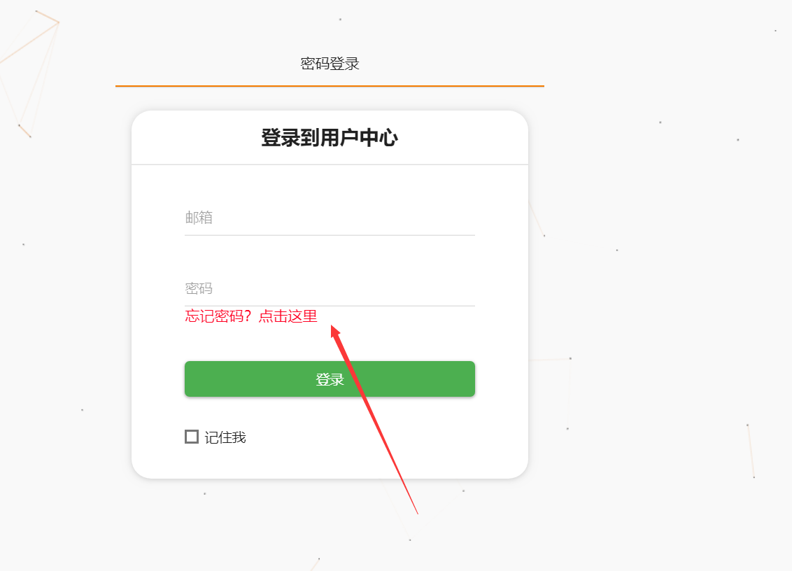
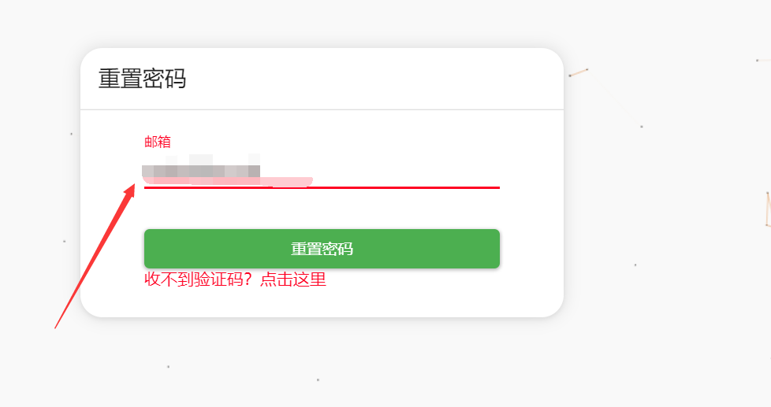
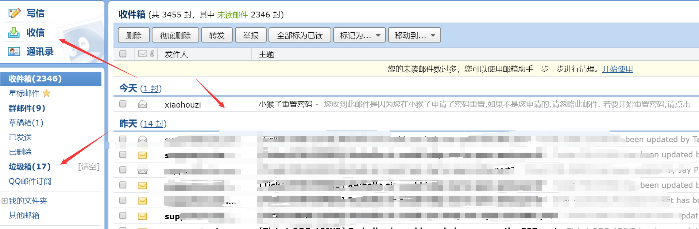
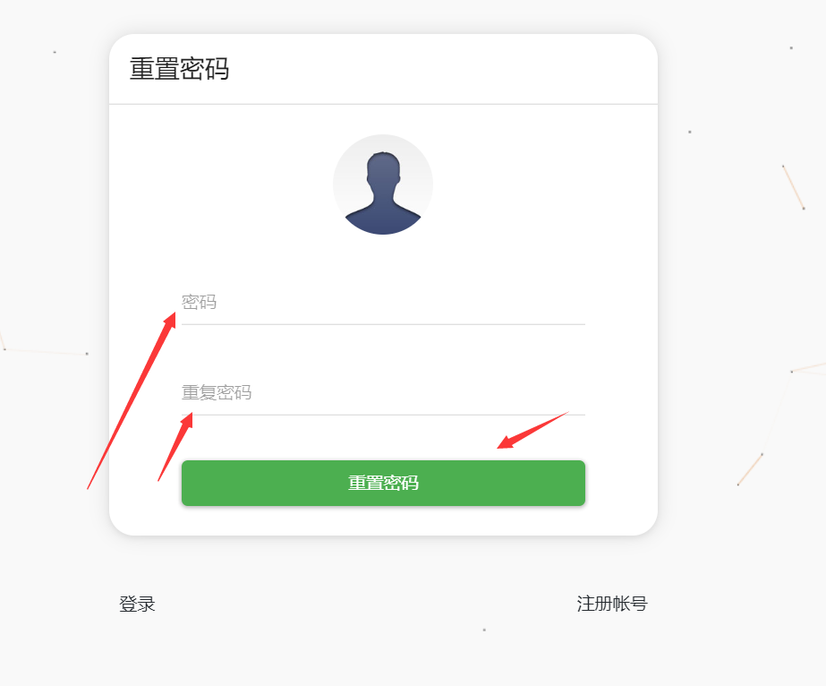

# 忘记密码小猴子密码怎么办？

如果您忘记小猴子密码了，但是知道邮箱？

您可以在小猴子面板的忘记密码这里点下忘记密码

[http://45.77.124.7/auth/login](http://45.77.124.7/auth/login)

然后输入自己注册时候的邮箱

注意小猴子发送的邮箱有很大几率会直接默认在垃圾箱里面，请各位在垃圾箱或者收件箱里面查看

下面输入两次新密码后点充重置密码就可以了

