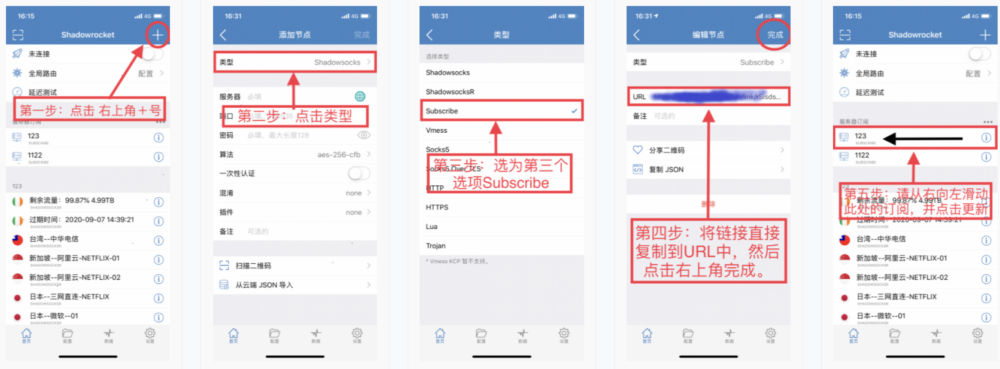

# Shadowrocket 小火箭-SSR\&V2RAY

Shadowrocket 一款 付费苹果的SSR\&V2RAY客户端,美区价格为2.99美元

国区因为政策的原因无法下载，目前美区Apple id 可以下载该款软件

购买并下载链接

[https://apps.apple.com/us/app/shadowrocket/id932747118](https://apps.apple.com/us/app/shadowrocket/id932747118)

由于小火箭shadowrocket需要苹果美区ID 并需要支付2.99美金购买，然后需要信用卡支付，您可以在下面网站购买自带苹果美区的ID 购买共享的美区id，共享ID的价格为12.88RMB

[https://id.wohaobang.cn/product/](https://id.wohaobang.cn/product/)

以下为视频教程

方法一：订阅更新所有节点（推荐使用）

打开 Shadowrocket，点击 + 按钮

在新的页面中，选择「类型」为 Subscribe（订阅）用户中心–>节点订阅，优先使用v2ray更稳定

在 URL 一栏粘贴自己的`订阅链接` ，备注一栏可以随便填写

方法二：通过二维码扫描

方法三:通过复制节点链接 通常 ssr链接以ssr：//开头 v2ray 以为 vmess：//链接开头

海外苹果ID 购买网站一：

[https://appidstore.cc/](https://appidstore.cc)

[https://lgappleid.top/](https://lgappleid.top)

方法一:通过订阅方式获取节点服务器(推荐使用）

{% embed url="https://www.shenlejiang.xyz/wp-content/uploads/2020/06/QQ%E8%A7%86%E9%A2%9120200610182816-3.mp4" %}

打开 Shadowrocket，点击 + 按钮

在新的页面中，选择「类型」为 Subscribe（订阅）用户中心–>节点订阅，优先使用v2ray更稳定

在 URL 一栏粘贴自己的`订阅链接` ，备注一栏可以随便填写

第一步：点击右上角的 + 号

第二步：点击 类型

第三步：选择 第三项 Subscribe

此时应去小猴子网站面板–>用户中心–>点击复制您的订阅地址（可以导入SSR 和V2RAY订阅）

第四步：将复制的订阅地址粘贴进到URL一栏中，并点击完成

第五步：滑动此处订阅，并点击更新。（如果提示更新失败或超时，请参考本文最后的四种解决方法）

**注意：第五步手动更新订阅。非常重要，如果线路有问题，您想要更新线路，也可在此处点击更新，更新成功即可。（断开连接以后，才可以更新您的线路）**\
\
\

小猴子面板–>用户中心–>v2ray–>点击复\
\

如果您需要订阅V2RAY的节点，可以参照以上的步骤进行订阅并更新节点

您也可以直接通过节点导入的方式导入节点信息

————————————分割线————————————

**关于如何设置自动更新线路？【强烈推荐开启】**

打开自动更新的选项，软件每次开启时，会先进行自动更新操作

————————————分割线————————————

**IOS系统更新线路的方法指南：**\
**★注意：**\
&#x20; ****  **更新前请务必先断开启动按钮后再进行更新操作，否则更新失败。**

**★更新订阅线路的方法：**

**手动更新方法：**先**断开启动按钮**以后，从右向左（或从左向右）滑动订阅（www.avaclub.site），并点击**更新**即可。

**自动更新方法：**如果打开了自动更新（软件右下设置，服务器订阅，打开时更新），则先**断开启动**按钮，重启软件（完全关闭软件），稍等两秒就会提示更新成功。

**★延迟检测的方法：**

IOS可以点击启动按钮下方的（连通性测试）来测试线路是否畅通。显示超时的为不可用线路。

**★无法更新订阅（超时或失败）的四种解决方法：**

一：清理掉本软件的运行后台，稍等两三秒然后重新打开软件再更新。

二：切换WIFI或4G再更新。

三：关闭WIFI，在4G状态下打开飞行模式，稍等两三秒，关闭飞行模式，重复操作两次。网络恢复后使用流量进行更新订阅。

四：重启手机后进行更新订阅。
