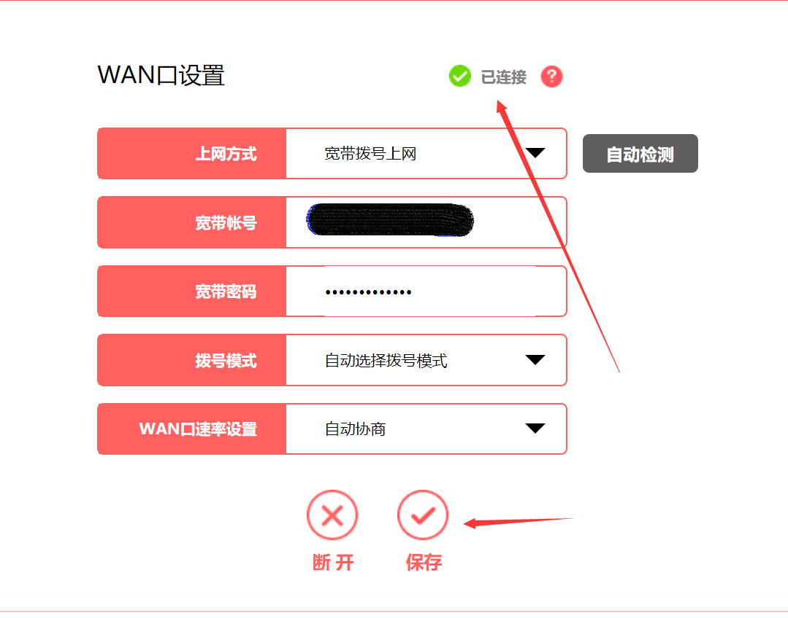

# 科学上网无法使用问题汇总

问题一：如果出现SS 节点被放弃，TCP不通但是UDP检测可以通过，然后为什么手机用流量可以使用，但是工作或者家里的WIFI却不行了呢

问题二：还有时候为什么，突然经常断断续续的不能连接，科学上网不稳定，过一会儿就不能使用了。

比如WIFI路由器里面或者电脑宽带连接的，在使用小猴子软件或者SS-TAP软件会出现以下图片的错。

解决办法：

一 路由器上面的解决办法。

我们要在宽带账号拨号这里断开自己的宽带连接。

首先登陆宽带路由器的里面，然后找到宽带拨号的界面，比如我这里的路由器是这样的一个页面。  

家庭或者公司宽带无法科学上网总结，因为我们的IP都是动态的，然后我们断开宽带连接的时候，当地通讯运营商会给一个新的IP，我们的科学上网又能愉快的工作了。

问题二：手机上面流量上面科学上网用不了问题汇总？

一般情况下面，如果您的账号还有vip时间，大部分情况下面还是可以使用的，请您保持您的账号有vip时间，然后打开路由器的手机设置那里有个飞行模式的按钮多按几次就可以了。

如果手机上面链接的wifi，wifi用不了请马上切换到流量上网，或者依照上面路由器的重新拨号来科学上网。

问题三：为什么有时候某些节点可以用某些节点不能用？

原因1：因为小猴子的节点切换需要30秒左右的时间。（请您慢点儿切换）

原因2：某些节点确实不可以用，因为我们经常会对不能用的节点进行修复或者更换，您需要做的就是经常在手机的订阅更新下最新的节点信息，一般手机ssr里面都有手动更新ssr链接或者自动更新ssr节点的。

问题四：为什么我把节点分享给朋友后我这里无法使用了？

原因：是因为小猴子给每个账号设定的限制是3个客户端同时科学上网，如果您分享给了朋友，然后朋友又免费的分发给了别人，可能您却不能科学上网了。

解决办法 ：在小猴子的面板里面点击账户资料修改，在这里您需要对节点密码进行修改，修改好后更新下订阅信息，您就可以再次使用了（这里只是防止恶意分享）

