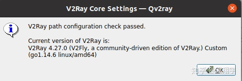
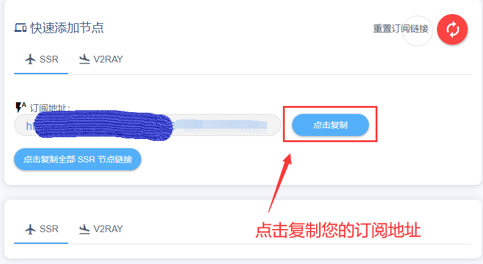
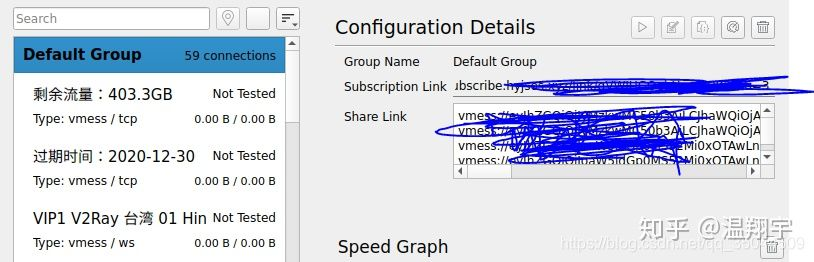

# QV2Ray

&#x20;1 选择工具

这里我们选择的是V2Ray工具，是一款非常优秀好用的跨平台的V2Ray电脑客户端软件。这款V2RayN电脑版功能强大全面，简单易用，使用后可以给用户提供很多帮助和便利。软件内置各种实用的功能，轻松的完成对服务器的添加，配置管理，而且对导入、导出的功能支持。欢迎有需要的朋友来下载使用

下载  [http://download.xiaohouzi.club:276/upload/Qv2ray.zip](http://download.xiaohouzi.club:276/upload/Qv2ray.zip)

\# 2 安装V2Ray

\## 2.1 通过软件中心安装 （不要使用这种方式，有点坑，直接跳到第二种：非安装方式）

.jpg>)

.jpg>)

安装结束之后直接打开会显示下面的界面：

.jpg>)

第二种安装方式：本地安装模式

下载链接



双击xxx.AppImage 文件，打开v2ray

v2ray 的软件界面：

按照顺序依次执行：

1：点击preference

2：选择 kernel setting

3：选择执行文件路径

4：选择v2ray-linux-64文件夹下的v2ray文件，点击open

5：添加v2ray 目录

6：选择v2ray-linux-64文件夹，点击open

7：测试是否通过

7：测试是否通过

使用v2ray

方式一：添加v2ray订阅链接

用户需要自己找到订阅链接，然后再向软件中添加订阅链接

订阅在小猴子用户中心，请点击复制 V2RAY订阅 -->会自动复制

添加订阅组

1：方式二：使用VMESS 链接添加订阅

点击Groups

双击想要的节点运行

