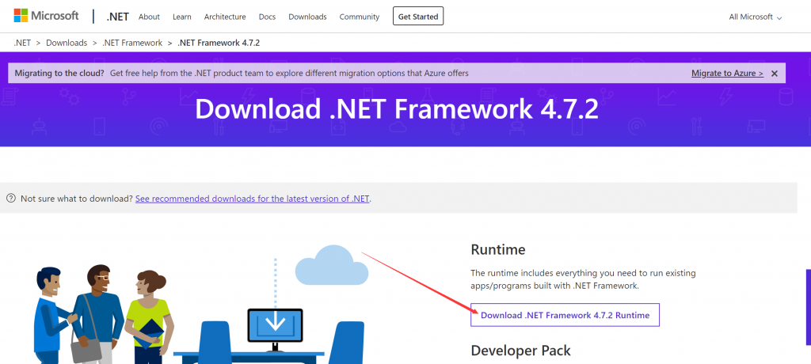

# SSR-电脑原版教程

SSR 的全称为SHADOWSOCKSRSSR原版软件下载下载



[SSR-电脑原版---  点击下载（中国大陆地区下载地址）](http://jc.muyiyun.top:276/ShadowsocksR-win-4.9.0.zip)

第一步首先确认shadowsocksr windows系统软件运行环境（win 10可以跳过）

注意：请您务必关闭或者卸载360 等杀毒软件（或者安装海外杀毒软件来保证您的电脑安全），要不然无法使用SSR，因为360等杀毒软件会收集您的电脑信息，会对您的电脑产生危险

运行必要环境 .net 4.7 以上



win 10一下系统版本一般需要下载更新到.net 4.7以上版本才能使用shadowsocksr 原版

第二步运行 shadowsocksR

请您运行这个ShadowsocksR软件

如果您是32位系统请运行ShadowsocksR-dotnet2.0.exe

如果您是64位系统请运行ShadowsocksR-dotnet2.0.exe

shadowsocksR 有2种方式可以添加代理节点

一种方式：直接对面板的节点进行采集

右下角的编辑服务器菜单

第二种方法：通过订阅节点来更新您的服务器节点信息。

第一步，复制面板的节点订阅地址

订阅地址目录在 我的-&gt;用户中心-&gt;普通节点订阅

设置SSR服务器订阅设置

在这里点击ADD 然后把面板的那个链接复制到里面，然后再网址这里添加您自己的订阅节点信息

每次需要更新节点信息的时候点击更新SSR服务器订阅信息（别点通过代理）

更新完成后，面板的节点信息会到您的SSR里面

最后一步，选择节点然后选择模式科学上网

PS: PAC模式意思是不代理国内网站不走科学上网，海外网站走科学上网

全局模式：意思是国内网站也通过代理服务器科学上网。

如果您设置好了，再打开谷歌或者youtube试试，成功了就可以科学上网了

