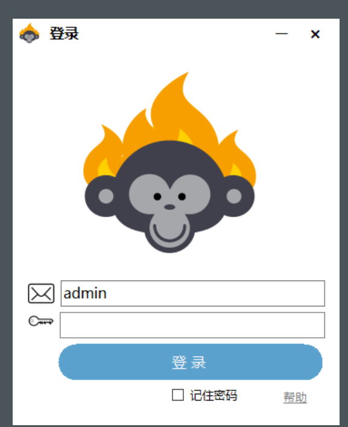
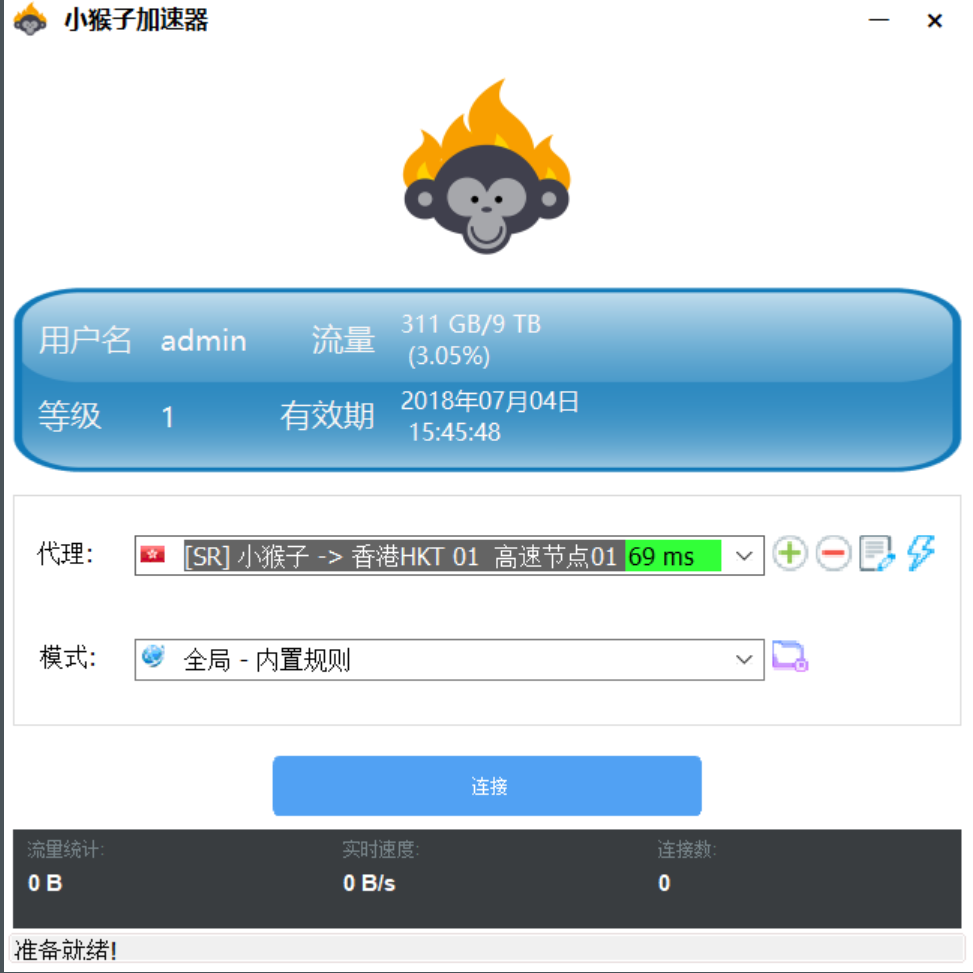

# 小猴子windows专用客户端教程（推荐）

小猴子专用客户端小猴子专用客户端下载—windows小猴子PC专用版本下载



[小猴子专用加速器---中国大陆地区下载](http://www.shenlejiang.xyz/ss/xiaohouzipc.rar)

适用于平台 windows xp 7 ,10 等 win版本的系统安装好后运行小猴子输入账号和密码选择您的代理服务器，然后连接就可以科学上网了

