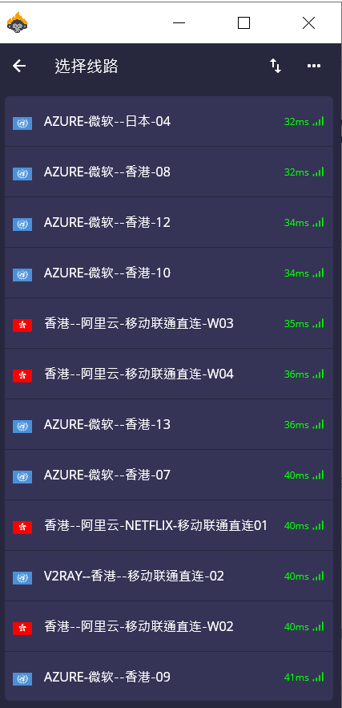
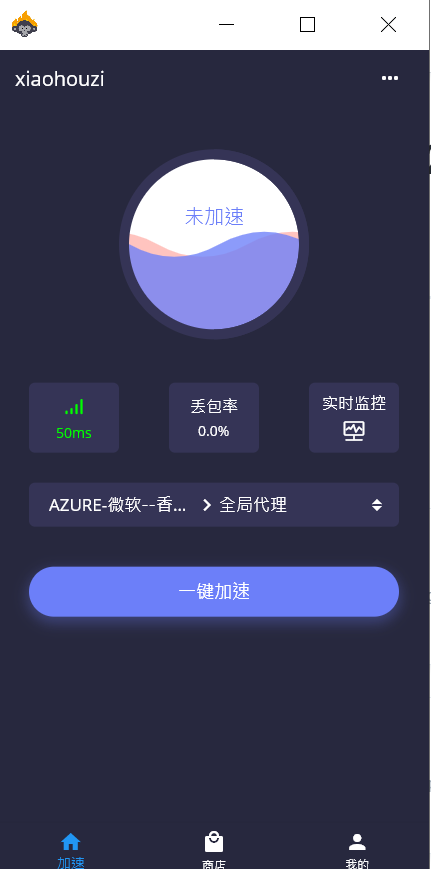

# 小猴子windows 专用 支持V2RAY SSR

小猴子V2RAY SSR 专用版  简单高效，您只需要输入您的小猴子账号和密码就可以科学上网

[小猴子V2ray+SSR下载 链接----&lt;&lt;&lt;&lt;&lt;点这里](http://www.shenlejiang.xyz/ss/xiaohouzissrv2.exe)

第一步使用小猴子邮箱和密码登陆客户端

第二步选择节点加速

第三步点击全局加速

