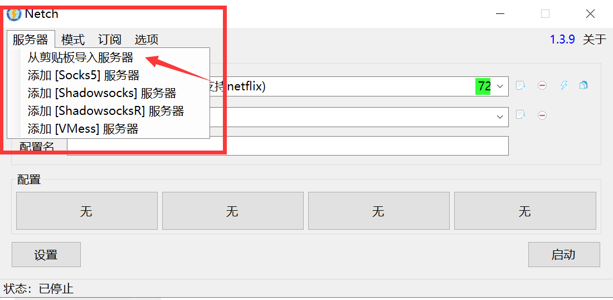
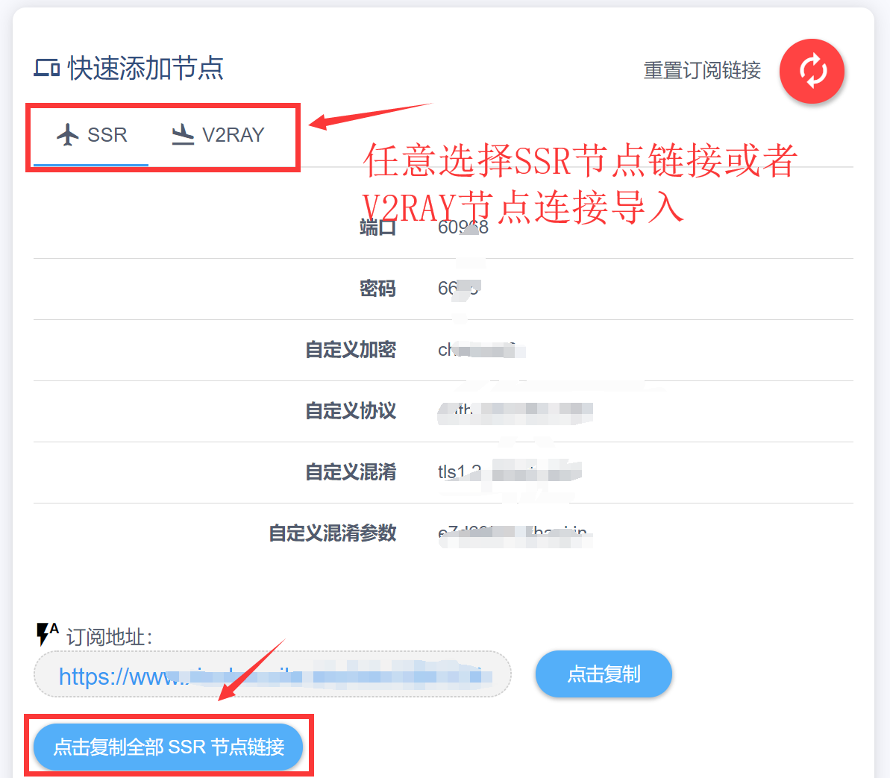
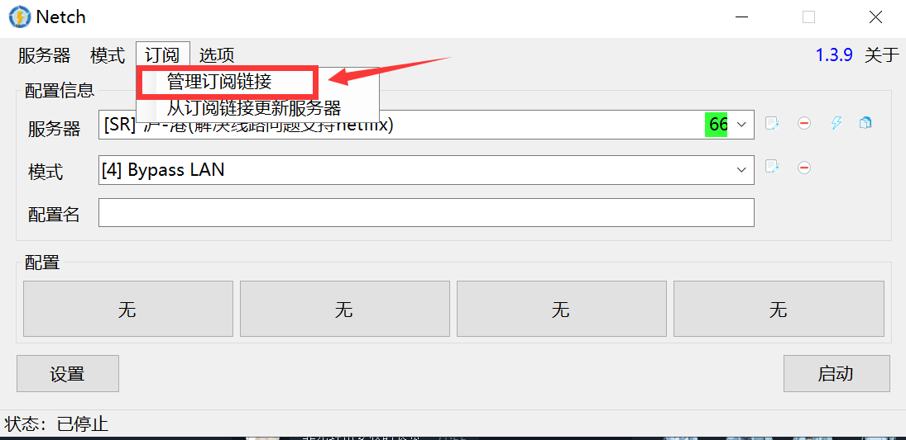
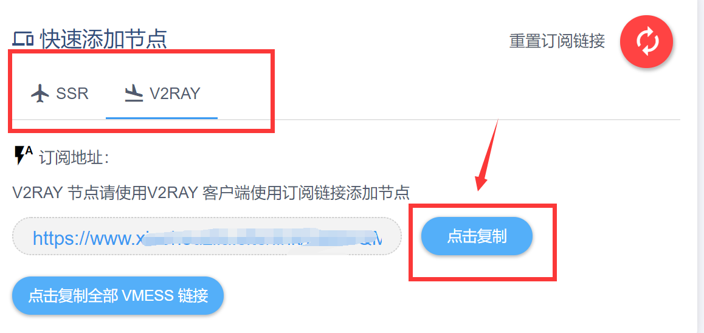
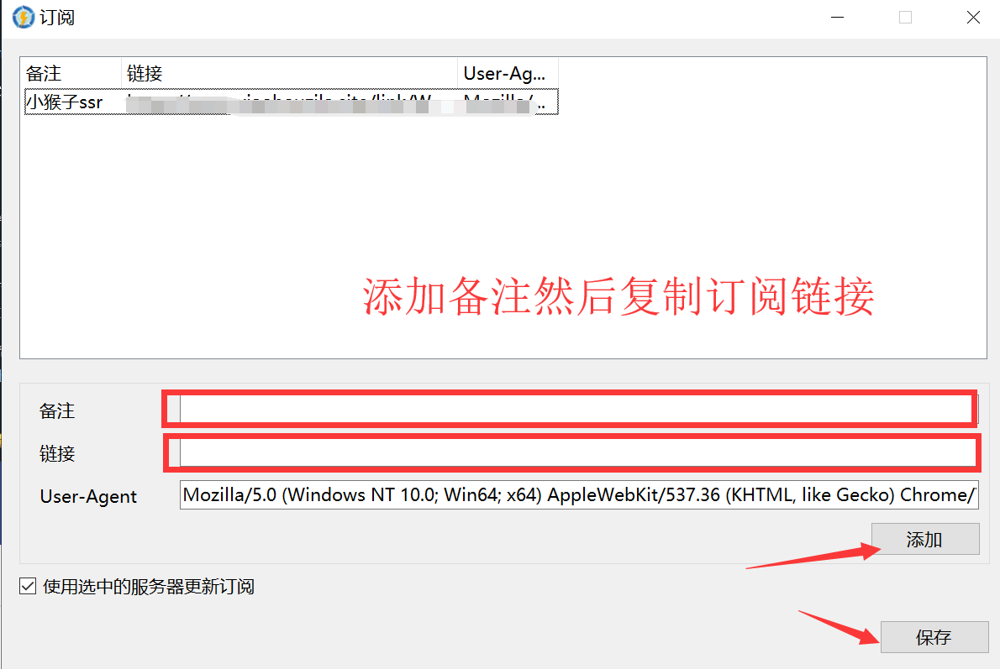
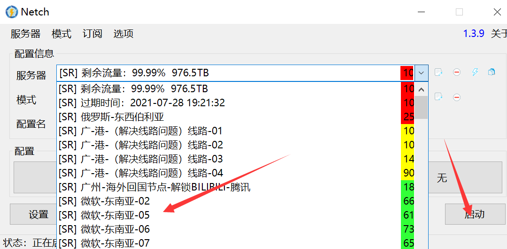

# V2RAY+SSR PC 同时支持\(Netch\)

Netch 是一款同时支持 SSR V2RAY 的加速软件，并且支持游戏加速





系统安装环境需要如下：一般win10以上系统都会满足一下运行环境

* [Visual C++ 运行库合集](https://www.google.com/search?q=Visual+C%2B%2B+%E8%BF%90%E8%A1%8C%E5%BA%93%E5%90%88%E9%9B%86)
* [.NET Framework 4.8](https://dotnet.microsoft.com/download/dotnet-framework/thank-you/net48-offline-installer)
* [TAP-Windows](https://build.openvpn.net/downloads/releases/tap-windows-9.21.2.exe)

关于模式选择：一般选择 Bypass LAN 模式会开启代理模式，然后您的浏览器就看可以科学上网了

下面是测试截图：

从剪切板导入服务器：

小猴子快速添加节点里面可以快速添加SSR或者V2RAY的节点信息

这里是通过订阅模式获取全部节点信息导入到Netch

下面服务器配置导入完成后选择一个节点，然后启动就可以了

