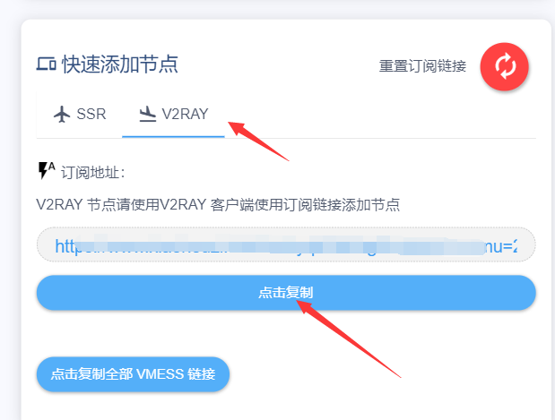
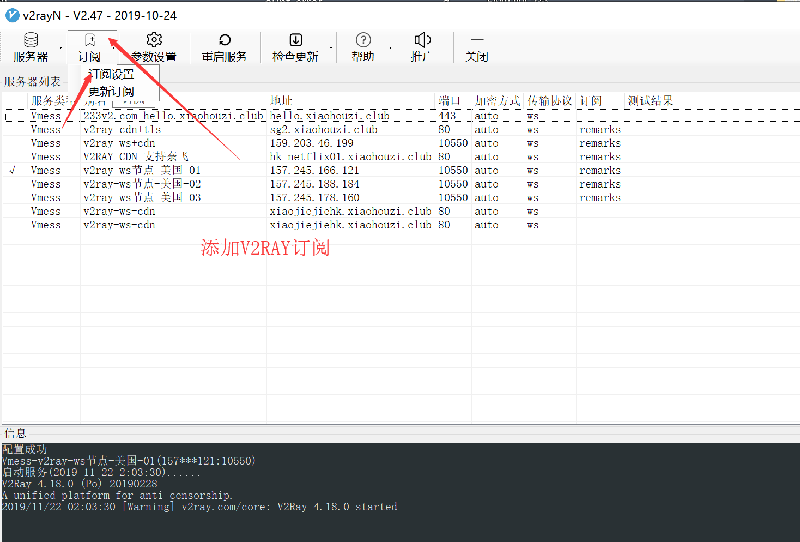
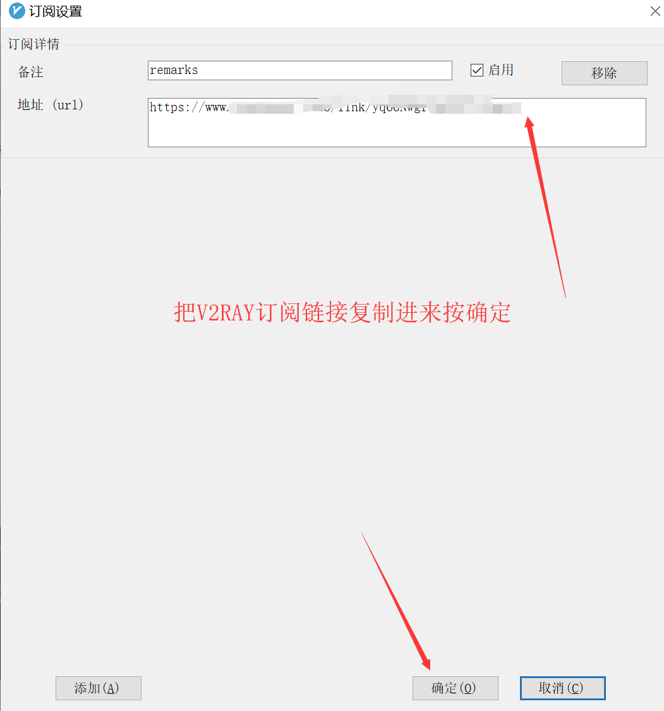
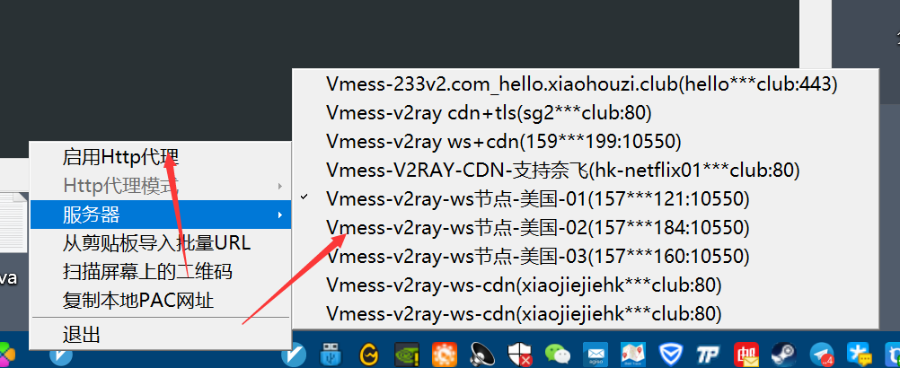
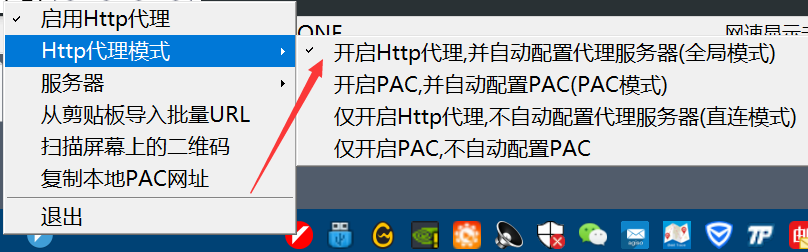

# V2RAY-windows pc 教程

第一步:下载 V2RayN，解压至任意磁盘并运行

第二步:双击任务栏右下角V2RayN图标-&gt;订阅-&gt;订阅设置-&gt;添加-&gt;填入下方的地址，点击确定

第三步:再次点击订阅-&gt;更新订阅，右击任务栏右下角V2RayN图标-&gt;启动Http代理

第四步:自行选择“Http代理模式”和“服务器”

[V2RAYN-WINDOWS下载](https://raw.githubusercontent.com/xiaohouzivpn/xiaohouzi/master/v2rayN-Core.zip)

