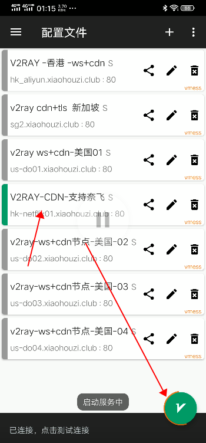

# V2RAY-安卓教程

V2RAY 安卓导入节点教程

[V2RAY 安卓下载下载](https://raw.githubusercontent.com/xiaohouzivpn/xiaohouzi/master/v2rayNG_v1.0.0_apkpure.com.apk)

第一步  打开软件 V2RAY 软件

第二步 网站复制订阅节点

第三步  将V2RAY订阅链接导入 V2RAY 软件并更新订阅

第四步  选择V2RAY节点科学上网

