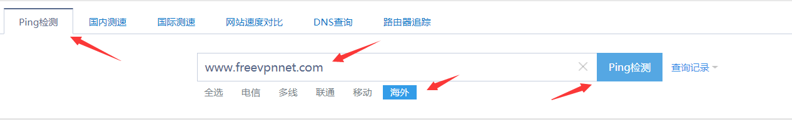
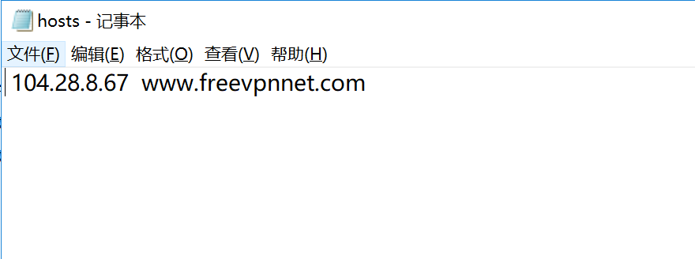

# 小猴子网站打不开解决办法

小猴子网站打不开 出现404 或者无法访问 那是因为域名被污染了，您可以直接使用ip访问 或者修改本地dns 

主页会更新最新的后台登陆地址：\(这里会更新最新的可用的ip登陆地址）

[https://menmanyu.gitbook.io/menmanyu/](https://menmanyu.gitbook.io/menmanyu/)

什么是DNS污染呢？

这个就是一个非常让人头疼的事情的，这种是最嚣张的了，DNS污染一般是直接把你的域名指向到其他ip的服务器，说的明白点就是你要访问的网站打不开了。

### 怎么知道自己要访问的域名被DNS污染了呢？

这里演示一下 测试 www.freevpnnet.com

同样也能对小猴子网站实现

这里我用[ping.china.com       ](http://ping.chinaz.com/)

ping检测 DNS是否正确指向

#### DNS 域名污染解决办法

如果您有需要的网站打不开，然后域名被墙了，如果这个网站对你很重要，这里会逐步告诉您 怎么直接打开网站。

步骤一：举例   www.freevpnnet.com 这个网站打不开了，然后该网站还是在运行的。

首先打开ping.chinaz.com   然后 ping 测试 www.freevpnnet.com .这里选择海外就行了

如上图正确的ip应该是 104.28.9.67

步骤二： 手动修改本机 host文件

现在以 window s10 为例

1  ·。首先找到  切换到  C:\**Windows**\System32\Drivers\etc

的目录  我们会发现有个hosts的文件

2 .

然后编辑这个文件  这里  前面写ip    104.28.8.67  就是刚刚我们从ping.chinaz.com  海外服务器找到的正确ip，  然后空格 写 www.freevpnnet.com   然后再保存文件，这样就可以成功打开 www.freevpnnet.com了

#### 可能遇到的问题解答

比如 ：

Win10修改编辑hosts文件无法保存怎么办？

[https://www.freevpnnet.com/dns%E6%B1%A1%E6%9F%93-%E8%A7%A3%E5%86%B3%E5%8A%9E%E6%B3%95/](https://www.freevpnnet.com/dns%E6%B1%A1%E6%9F%93-%E8%A7%A3%E5%86%B3%E5%8A%9E%E6%B3%95/)

